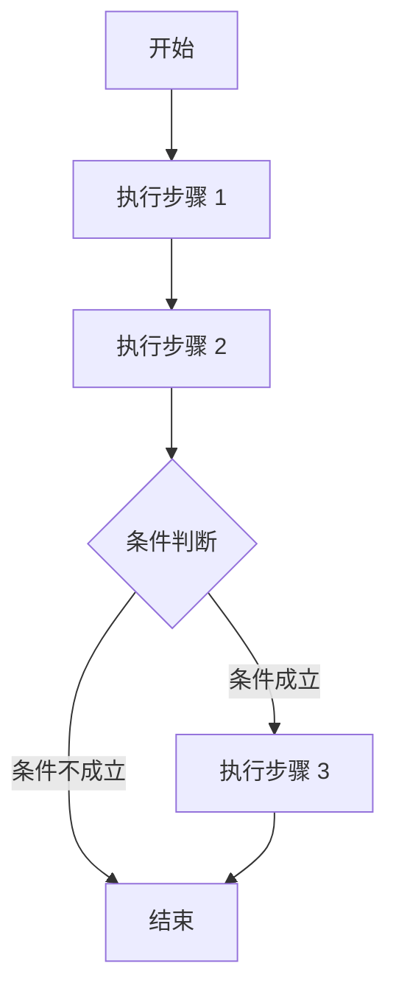

# Collections

公司内部任务收集仓库，包括bug、require、invalid等。

## Requirements

需求收集

### Needs

#### 1. 项目名称

项目名称的编写应该尽可能简短且符合实际使用需求。名称只作为别名，实际推动使用项目内部代码（项目标识）。

#### 2. 项目标识

项目标识使用结构为：Group-Tag-Region-Time

其中Group编号说明：

| Group | Description |
|:-----:|:-----------:|
|  000  |  软件部门   |
|  001  |  光学部门   |
|  002  |  机械部门   |
|   -   |    待定     |

Tag编号说明：

| Tag | Description |
|:---:|:-----------:|
| 000 |  桌面程序   |
| 001 | 控制台程序  |
| 002 |    脚本     |
|  -  |    待定     |

且可以在Tag后方添加类似win7、linux-arm、之类的附加属性来约束目标平台要求。

Region编号说明：

| Region | Description  |
|:------:|:------------:|
|   0    | 公司内部使用 |
|   1    | 公司外部使用 |
|   -    |     待定     |

Time说明：年月日。例如20230801

完整的标识类似：000-001win64-0-20230101

### 3. 需求类别

|    Type     |               Description                |
|:-----------:|:----------------------------------------:|
|   require   |               增加新的功能               |
|     bug     |            运行闪退或者不运行            |
|    docs     |                文档的修订                |
|   invalid   | 不符合预期的运行结果或运行过程不符合预期 |
|  duplicate  |                 需求重复                 |
| enhancement |                功能的加强                |

#### 4. 需求提出人

> 这里的需求提出人可以是其他客户提出，由内部委托发出。

名字或者代号（这里必须现有zoho后再到这里提出）

#### 5.业务价值（选填）

业务价值是指一个需求、特性或项目对业务目标、客户价值和组织利益的贡献程度。它涉及了项目在经济、战略和运营方面的影响，可以是直接的、定量的效益，也可以是间接的、定性的影响。

#### 6.功能

功能为非技术性需求，需要列出具体的功能或特性，包括所需的行为、用户界面、流程等。可以使用用例、用户故事或功能列表等方式来描述。

#### 7.非功能需求

非功能需求为技术性需求，包括性能、安全性、可扩展性等方面的需求，请明确列出。

#### 8.时间期限

给出最迟的完成时间。

#### 9.验收标准

编写清晰、详细且易于理解的验收标准对于确保项目需求被满足以及项目交付成功非常重要。以下是编写验收标准的一些建议：

1. **明确的结果描述：** 针对每个需求，描述期望的最终结果是什么样的，以确保团队和相关利益相关者对项目的预期达成一致。

2. **可衡量的标准：** 使用具体的、可衡量的标准来描述期望的结果。这样可以使验收变得客观，避免主观判断。

3. **准确的量化指标：** 如果可能，使用数量化的指标来衡量结果。例如，处理时间、错误率、性能参数等。

4. **场景和用例：** 描述在什么情况下和如何使用特定功能。列举一些使用场景或用例，以确保涵盖了各种情况。

5. **边界条件：** 描述功能的边界条件和限制。这有助于避免误解，确保所有人对功能的限制有清楚的认识。

6. **用户界面和交互：** 如果需求涉及用户界面，描述期望的界面设计、布局、样式等。

7. **示例和截图：** 可以包含示例、流程图、界面截图等来进一步说明期望的结果。

8. **性能要求：** 如果涉及性能需求，描述预期的性能参数，例如响应时间、并发用户数等。

9. **兼容性和安全性：** 描述需求在不同平台、浏览器、设备上的兼容性，以及涉及的安全性要求。

10. **异常情况处理：** 描述当出现异常情况时，系统应如何处理和反应。

11. **数据和输入：** 描述系统应如何处理各种类型的输入数据，包括合法和非法的情况。

12. **测试用例：** 根据验收标准编写相应的测试用例，以确保项目在满足标准时能够通过测试。

13. **用户验收：** 确定哪些用户或利益相关者将参与验收过程，并确定他们是否满意。

14. **修复措施：** 描述如果某些标准没有达到，需要采取什么措施来解决问题。

15. **文档要求：** 确定相关文档或支持材料是否需要在验收前提供。

以下是一个示例验收标准的片段，以便更好地理解：

需求：**用户登录功能**
验收标准：
- 用户应能够在登录页面上输入正确的用户名和密码，登录成功后进入用户主页。
- 当用户输入错误的用户名或密码时，系统应显示适当的错误消息。
- 登录操作的平均响应时间应在2秒内。
- 用户界面应在常见的浏览器（Chrome、Firefox、Safari）上正常显示和操作。
- 用户登录失败后，应存在“忘记密码”选项，允许用户重置密码。
- 系统应记录成功和失败的登录尝试，以供后续分析。

请注意，具体的验收标准会根据项目的性质和需求而有所不同。编写验收标准时，确保语言清晰，用词准确，以确保项目团队和相关利益相关者对需求的期望达成共识。

#### 10.功能执行流程图（选填）

类似下面内容:

#### 11.文档附件

一些不在表单的需求部分，使用文档描述。
